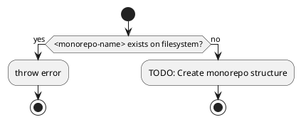
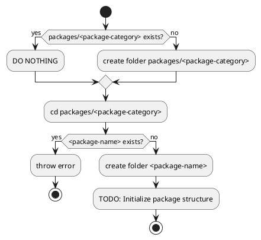

# CLI Tools & Utilities Todo

## High Priority Tools

### `cpfd` - Copy Files From Dependencies
**Status**: High Priority - Daily workflow improvement

Create a tool to copy files from dependencies into the project.

### `increase-version` 
**Status**: High Priority - Publishing workflow

Automate version bumping to ensure every publish has a new version.

### `add-scripts`
**Status**: High Priority - Package creation workflow

Add new NPM scripts to the target package every time a new package is created.

## Monochromatic CLI Development

**Current Direction**: Writing a few moon plugins instead of a full CLI.

### `monochromatic new <monorepo-name>`



### `monochromatic new <package-category>/<package-name>`



## Utility Tools

### `append` util
**Status**: Medium Priority

Terminal append util that appends a new line to a specified file.

```bash
append "my new line" --to myfile.md
append "my new line1" --to myfile.md
append "my new line1\nMy new line2" --to myfile.md
append "my new line1" "my new line2" --to myfile.md
```

### Write my own moon MCP server
**Status**: Medium Priority

Create a custom MCP server for better Moon integration with Claude/AI tools.

## Tool Development Guidelines

### Script Preferences
- **NEVER write bash/shell scripts** (non-portable, unreadable, unfamiliar)
- When scripts are needed, create TypeScript files as `moon.<action>.ts` in `packages/module/es/src/`
- Use Bun to execute TypeScript scripts directly
- Avoid creating main() functions
  - Instead of wrapping code in a main() function, write top-level code directly
  - Bad: `function main() { /* code */ } main();`
  - Good: Just write the code at the top level
  - For async operations, use top-level await: `await someAsyncOperation();`
- Avoid exiting with 0; just let the program naturally run to the end
- NEVER use process.exit() - throw errors instead

### Tool Version Management
- **Only pin tool versions when necessary** with clear justification
- If pinning is required, always include comments explaining why
- Example: `# Pin to v1.2.3 - v1.3.0 introduced breaking API changes`
- Document version requirements in both the pinning file and README
- Regularly review pinned versions to check if constraints still apply

## Grammar and Linting Tools

### Replace `vale` with `harper` or another grammar checker
**Status**: Medium Priority

`vale` gives `EvalSymlinks: too many links` error. Need to find a replacement.

## Advanced Utilities

### Pattern Matching Library
**Status**: Low Priority - Experimental

Build our own TypeScript pattern matching library that supports async predicates in when clauses, powered by Zod for schema validation.

#### Features
- Support for async predicates in `.when()` clauses
- Zod integration for type-safe pattern validation
- Maintain ts-pattern's excellent type inference
- Compatible API for migration from ts-pattern

#### Example API
```typescript
import { match } from '@monochromatic-dev/module-es';
import { z } from 'zod';

// Async predicate support
const result = await match(value)
  .when(async (v) => await checkDatabase(v), () => 'found in db')
  .when(z.string().email(), () => 'valid email')
  .otherwise(() => 'default');

// Or with pre-computed async values
const result = await match({ hasFeature: await checkFeature() })
  .with({ hasFeature: true }, () => 'feature enabled')
  .otherwise(() => 'feature disabled');
```

## Implementation Notes

- Use `ripgrep` (rg) for fast text searching instead of navigating pnpm's complex node_modules structure
- Focus on tools that improve daily development workflow
- Prioritize TypeScript implementation over shell scripts for better maintainability
- Integrate with Moon's task system where possible