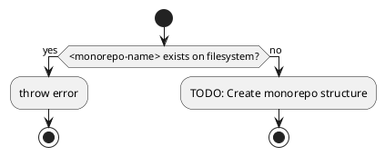
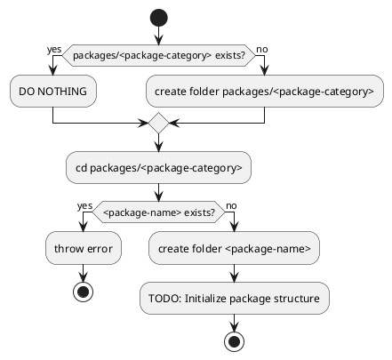

# CLI Tools & Utilities Todo

## Cross-References
- [**Build System Integration**](TODO.build-system.md#package-management-improvements) - Package management tooling integration
- [**Automation Tools**](TODO.automation.md#development-automation) - Development workflow automation
- [**Package Development**](TODO.packages.md#build-utilities) - Build utility enhancement
- [**Performance Tools**](TODO.performance.md#build-performance) - Performance monitoring and optimization tools
- [**Security Tools**](TODO.security.md#development-security) - Security-focused development tools

## High Priority Tools

### `cpfd` - Copy Files From Dependencies
**Status**: High Priority - Daily workflow improvement

Create a tool to copy files from dependencies into the project.

#### Detailed Implementation Tasks
- [ ] Design CLI interface with intuitive commands and options
- [ ] Implement dependency resolution and file discovery
- [ ] Add support for glob patterns and file filtering
- [ ] Create configuration file support for common copy operations
- [ ] Add dry-run mode for preview before copying
- [ ] Implement file conflict resolution and overwrite protection
- [ ] Add progress reporting for large copy operations
- [ ] Create integration with Moon task system

**Cross-Reference**: See [Build System Todo](TODO.build-system.md#package-management-improvements) for related package tooling.

### `increase-version`
**Status**: High Priority - Publishing workflow

Automate version bumping to ensure every publish has a new version.

#### Detailed Implementation Tasks
- [ ] Implement semantic versioning compliance
- [ ] Add support for conventional commit parsing
- [ ] Create interactive version selection mode
- [ ] Add batch version updating across multiple packages
- [ ] Implement version constraint validation
- [ ] Add changelog generation integration
- [ ] Create git tag automation with proper metadata
- [ ] Add publishing workflow integration

**Cross-Reference**: See [Automation Todo](TODO.automation.md#release-automation) for comprehensive release automation.

### `add-scripts`
**Status**: High Priority - Package creation workflow

Add new NPM scripts to the target package every time a new package is created.

#### Detailed Implementation Tasks
- [ ] Create template-based script generation
- [ ] Implement package type detection (library, app, config, etc.)
- [ ] Add script customization based on package category
- [ ] Create script validation and testing
- [ ] Add integration with package scaffolding tools
- [ ] Implement script documentation generation
- [ ] Create script maintenance and update utilities

**Cross-Reference**: See [Packages Todo](TODO.packages.md#cross-package-improvements) for package standardization.

## Monochromatic CLI Development

**Current Direction**: Writing a few moon plugins instead of a full CLI.

### `monochromatic new <monorepo-name>`



#### Implementation Details
- [ ] Design monorepo template structure
- [ ] Implement configuration file generation
- [ ] Add project initialization automation
- [ ] Create development environment setup
- [ ] Add documentation generation
- [ ] Implement best practices enforcement

### `monochromatic new <package-category>/<package-name>`



#### Implementation Details
- [ ] Create package category templates
- [ ] Implement package structure scaffolding
- [ ] Add package configuration automation
- [ ] Create package documentation templates
- [ ] Add package testing setup automation
- [ ] Implement package integration validation

**Cross-Reference**: See [Packages Todo](TODO.packages.md#configuration-packages) for package template details.

## Utility Tools

### `append` util
**Status**: Medium Priority

Terminal append util that appends a new line to a specified file.

```bash
append "my new line" --to myfile.md
append "my new line1" --to myfile.md
append "my new line1\nMy new line2" --to myfile.md
append "my new line1" "my new line2" --to myfile.md
```

#### Enhanced Implementation
- [ ] Add support for atomic file operations
- [ ] Implement file locking for concurrent access
- [ ] Add backup creation before modification
- [ ] Create undo/rollback functionality
- [ ] Add content validation and formatting
- [ ] Implement batch append operations

### Write my own moon MCP server
**Status**: Medium Priority

Create a custom MCP server for better Moon integration with Claude/AI tools.

#### Detailed Implementation Tasks
- [ ] Design MCP server architecture for Moon integration
- [ ] Implement Moon task discovery and execution tools
- [ ] Add Moon configuration manipulation tools
- [ ] Create Moon cache management tools
- [ ] Implement Moon performance monitoring tools
- [ ] Add Moon troubleshooting and debugging tools
- [ ] Create comprehensive documentation and examples

**Cross-Reference**: See [Automation Todo](TODO.automation.md#development-automation) for AI-assisted development tools.

## Advanced Development Tools

### Code Generation and Scaffolding
**Status**: Normal Priority - Developer productivity

- [ ] Create automated component scaffolding tools
- [ ] Implement boilerplate code generation
- [ ] Add template-driven development tools
- [ ] Create configuration file generation utilities
- [ ] Implement automated documentation generation tools
- [ ] Add code transformation and migration utilities

**Cross-Reference**: See [Automation Todo](TODO.automation.md#code-generation-and-templating) for comprehensive code generation.

### Development Workflow Tools
**Status**: Normal Priority - Developer experience

- [ ] Create development environment validation tools
- [ ] Implement automated development setup tools
- [ ] Add development productivity measurement tools
- [ ] Create development troubleshooting utilities
- [ ] Implement development workflow optimization tools
- [ ] Add development collaboration enhancement tools

**Cross-Reference**: See [Development Todo](TODO.development.md#development-workflow-improvements) for workflow optimization.

## Tool Development Guidelines

### Script Preferences
- **NEVER write bash/shell scripts** (non-portable, unreadable, unfamiliar)
- When scripts are needed, create TypeScript files as `moon.<action>.ts` in `packages/module/es/src/`
- Use Bun to execute TypeScript scripts directly
- Avoid creating main() functions
  - Instead of wrapping code in a main() function, write top-level code directly
  - Bad: `function main() { /* code */ } main();`
  - Good: Just write the code at the top level
  - For async operations, use top-level await: `await someAsyncOperation();`
- Avoid exiting with 0; just let the program naturally run to the end
- NEVER use process.exit() - throw errors instead

### Tool Version Management
- **Only pin tool versions when necessary** with clear justification
- If pinning is required, always include comments explaining why
- Example: `# Pin to v1.2.3 - v1.3.0 introduced breaking API changes`
- Document version requirements in both the pinning file and README
- Regularly review pinned versions to check if constraints still apply

### Security Considerations for CLI Tools
**Status**: High Priority - Tool security

- [ ] Implement input validation for all CLI arguments
- [ ] Add secure file handling and path validation
- [ ] Create secure credential handling for tools requiring authentication
- [ ] Implement proper error handling without information disclosure
- [ ] Add security scanning for generated code and configurations
- [ ] Create secure tool update and distribution mechanisms

**Cross-Reference**: See [Security Todo](TODO.security.md#development-security) for comprehensive security practices.

## Grammar and Linting Tools

### Replace `vale` with `harper` or another grammar checker
**Status**: Medium Priority

`vale` gives `EvalSymlinks: too many links` error. Need to find a replacement.

#### Investigation Tasks
- [ ] Evaluate harper grammar checker capabilities and performance
- [ ] Test alex for inclusive language checking
- [ ] Research textlint for comprehensive text validation
- [ ] Evaluate language-tool for advanced grammar checking
- [ ] Test write-good for prose improvement suggestions
- [ ] Compare performance and accuracy of different tools

## Advanced Utilities

### Pattern Matching Library
**Status**: Low Priority - Experimental

Build our own TypeScript pattern matching library that supports async predicates in when clauses, powered by Zod for schema validation.

#### Features
- Support for async predicates in `.when()` clauses
- Zod integration for type-safe pattern validation
- Maintain ts-pattern's excellent type inference
- Compatible API for migration from ts-pattern

#### Example API
```typescript
import { match } from '@monochromatic-dev/module-es';
import { z } from 'zod';

// Async predicate support
const result = await match(value)
  .when(async (v) => await checkDatabase(v), () => 'found in db')
  .when(z.string().email(), () => 'valid email')
  .otherwise(() => 'default');

// Or with pre-computed async values
const result = await match({ hasFeature: await checkFeature() })
  .with({ hasFeature: true }, () => 'feature enabled')
  .otherwise(() => 'feature disabled');
```

#### Implementation Tasks
- [ ] Design type-safe pattern matching API
- [ ] Implement async predicate support
- [ ] Add Zod schema integration
- [ ] Create comprehensive type inference system
- [ ] Add performance optimization for pattern matching
- [ ] Implement extensive testing and documentation

**Cross-Reference**: See [Packages Todo](TODO.packages.md#async-iterator-utilities) for related async utility development.

### Development Environment Tools
**Status**: Normal Priority - Environment management

- [ ] Create environment consistency checking tools
- [ ] Implement development environment migration utilities
- [ ] Add environment troubleshooting and repair tools
- [ ] Create environment performance monitoring tools
- [ ] Implement environment security validation tools
- [ ] Add environment backup and restore utilities

**Cross-Reference**: See [Development Todo](TODO.development.md#development-environment-automation) for environment automation.

### Performance and Monitoring Tools
**Status**: Normal Priority - Performance optimization

- [ ] Create build performance monitoring tools
- [ ] Implement runtime performance profiling utilities
- [ ] Add resource usage monitoring and alerting tools
- [ ] Create performance regression detection tools
- [ ] Implement performance optimization recommendation tools
- [ ] Add performance benchmarking and comparison utilities

**Cross-Reference**: See [Performance Todo](TODO.performance.md#monitoring--metrics) for comprehensive performance monitoring.

## Implementation Notes

- Use `ripgrep` (rg) for fast text searching instead of navigating pnpm's complex node_modules structure
- Focus on tools that improve daily development workflow
- Prioritize TypeScript implementation over shell scripts for better maintainability
- Integrate with Moon's task system where possible
- Follow security best practices for all tool development
- Implement comprehensive error handling and user feedback
- Create thorough documentation and usage examples for all tools
- Add automated testing for all CLI tools
- Consider performance impact and optimization opportunities
- Ensure cross-platform compatibility where applicable

## Success Criteria

- [ ] All high-priority CLI tools implemented and tested
- [ ] Tools integrate seamlessly with existing development workflow
- [ ] Comprehensive documentation and examples provided
- [ ] Security best practices implemented and validated
- [ ] Performance optimization applied where beneficial
- [ ] Automated testing ensures tool reliability
- [ ] Tools enhance developer productivity measurably
- [ ] Integration with Moon task system optimized
