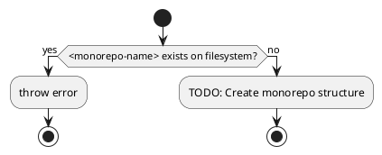
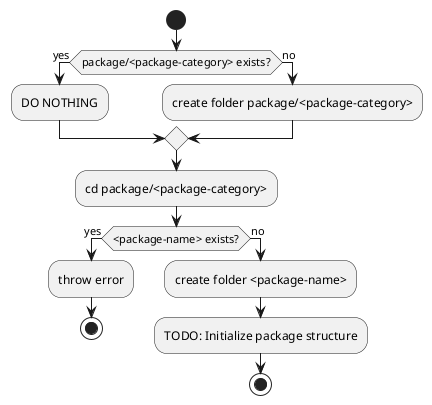

# CLI Tools & Utilities Todo

## Cross-References

- [**Build System Integration**](build-system.md#package-management-improvements):
   Package management tooling integration
- [**Automation Tools**](automation.md#development-automation):
   Development workflow automation
- [**Package Development**](packages.md#build-utilities):
   Build utility enhancement
- [**Performance Tools**](performance.md#build-performance):
   Performance monitoring and optimization tools
- [**Security Tools**](security.md#development-security):
   Security-focused development tools

## High Priority Tools

### `cpfd`: Copy Files From Dependencies

**Status**:
 Deprecated;
 superseded by `package/dev-script/file-enforcer`

### `increase-version`

**Status**:
 Deprecated;
 no longer needed after monorepo adoption (no frequent npm publishes)

### `add-scripts`

**Status**:
 Deprecated;
 handled by file-enforcer and mise task templates

## Monochromatic CLI Development

**Current state**:
 Dedicated CLI packages live under `package/cli/`.
The old `monochromatic new ...` scaffolding ideas remain unimplemented.

### `monochromatic new <monorepo-name>`



#### Implementation Details

- [ ] Design monorepo template structure
- [ ] Implement configuration file generation
- [ ] Add project initialization automation
- [ ] Create development environment setup
- [ ] Add documentation generation
- [ ] Implement best practices enforcement

### `monochromatic new <package-category>/<package-name>`



#### Implementation Details

- [ ] Create package category templates
- [ ] Implement package structure scaffolding
- [ ] Add package configuration automation
- [ ] Create package documentation templates
- [ ] Add package testing setup automation
- [ ] Implement package integration validation

**Cross-Reference**:
 See [Packages Todo](packages.md#configuration-packages) for package template details.

## Utility Tools

### `append` util

**Status**:
 Done;
 shipped as `task-append` in `package/dev-script/task-util/src/append.ts`,
 with bin entry,
 README section,
 and unit tests covering create/append/multiline/permission-error cases.

```bash
task-append "my new line" --to myfile.md
task-append "my new line1" --to myfile.md
task-append "my new line1\nMy new line2" --to myfile.md
task-append "my new line1" "my new line2" --to myfile.md
```

#### Remaining gaps

- [ ] Create the target file when absent instead of throwing
- [ ] Optional `--no-newline` flag
- [ ] Optional `--prefix`/`--suffix` flags

### Write my own mise MCP server

**Status**:
 Medium Priority

Create a custom MCP server for better mise integration with Claude/AI tools.

#### Detailed Implementation Tasks

- [ ] Design MCP server architecture for mise integration
- [ ] Implement mise task discovery and execution tools
- [ ] Add mise configuration manipulation tools
- [ ] Create mise cache management tools
- [ ] Implement mise performance monitoring tools
- [ ] Add mise troubleshooting and debugging tools
- [ ] Create comprehensive documentation and examples

**Cross-Reference**:
 See [Automation Todo](automation.md#development-automation) for AI-assisted development tools.

## Advanced Development Tools

### Code Generation and Scaffolding

**Status**:
 Normal Priority,
 Developer productivity

- [ ] Create automated component scaffolding tools
- [ ] Implement boilerplate code generation
- [ ] Add template-driven development tools
- [ ] Create configuration file generation utilities
- [ ] Implement automated documentation generation tools
- [ ] Add code transformation and migration utilities

**Cross-Reference**:
 See [Automation Todo](automation.md#code-generation-and-templating) for comprehensive code generation.

### Development Workflow Tools

**Status**:
 Normal Priority,
 Developer experience

- [ ] Create development environment validation tools
- [ ] Implement automated development setup tools
- [ ] Add development productivity measurement tools
- [ ] Create development troubleshooting utilities
- [ ] Implement development workflow optimization tools
- [ ] Add development collaboration enhancement tools

**Cross-Reference**:
 See [Development Todo](development.md#development-workflow-improvements) for workflow optimization.

## Tool Development Guidelines

### Script Preferences

- **NEVER write bash/shell scripts** (non-portable,
   unreadable,
   unfamiliar)
- When scripts are needed,
   create TypeScript files as `mise.<action>.ts` in `package/module/es/src/`
- Use Node to execute TypeScript scripts directly
- Avoid creating main() functions
  - Instead of wrapping code in a main() function,
     write top-level code directly
  - Bad:
     `function main() { /* code */ } main();`
  - Good:
     Just write the code at the top level
  - For async operations,
     use top-level await:
     `await someAsyncOperation();`
- Avoid exiting with 0;
   just let the program naturally run to the end
- NEVER use process.
  exit():
   throw errors instead

### Tool Version Management

- **Only pin tool versions when necessary** with clear justification
- If pinning is required,
   always include comments explaining why
- Example:
   `# Pin to v1.2.3 - v1.3.0 introduced breaking API changes`
- Document version requirements in both the pinning file and README
- Regularly review pinned versions to check if constraints still apply

### Security Considerations for CLI Tools

**Status**:
 High Priority,
 Tool security

- [ ] Implement input validation for all CLI arguments
- [ ] Add secure file handling and path validation
- [ ] Create secure credential handling for tools requiring authentication
- [ ] Implement proper error handling without information disclosure
- [ ] Add security scanning for generated code and configurations
- [ ] Create secure tool update and distribution mechanisms

**Cross-Reference**:
 See [Security Todo](security.md#development-security) for comprehensive security practices.

## Grammar and Linting Tools

### Replace `vale` with `harper` or another grammar checker

**Status**:
 Medium Priority

`vale` gives `EvalSymlinks: too many links` error.
 Need to find a replacement.

#### Investigation Tasks

- [ ] Evaluate harper grammar checker capabilities and performance
- [ ] Test alex for inclusive language checking
- [ ] Research textlint for comprehensive text validation
- [ ] Evaluate language-tool for advanced grammar checking
- [ ] Test write-good for prose improvement suggestions
- [ ] Compare performance and accuracy of different tools

## Advanced Utilities

### Pattern Matching Library

**Status**:
 Low Priority,
 Experimental

Build our own TypeScript pattern matching library that supports async predicates in when clauses,
 powered by Zod for schema validation.

#### Features

- Support for async predicates in `.when()` clauses
- Zod integration for type-safe pattern validation
- Maintain ts-pattern's excellent type inference
- Compatible API for migration from ts-pattern

#### Example API

```typescript
import { match, } from '@monochromatic-dev/module-es';
import { z, } from 'zod';

// Async predicate support
const result = await match(value,)
  .when(async v => await checkDatabase(v,), () => 'found in db',)
  .when(z.string().email(), () => 'valid email',)
  .otherwise(() => 'default');

// Or with pre-computed async values
const result = await match({ hasFeature: await checkFeature(), },)
  .with({ hasFeature: true, }, () => 'feature enabled',)
  .otherwise(() => 'feature disabled');
```

#### Implementation Tasks

- [ ] Design type-safe pattern matching API
- [ ] Implement async predicate support
- [ ] Add Zod schema integration
- [ ] Create comprehensive type inference system
- [ ] Add performance optimization for pattern matching
- [ ] Implement extensive testing and documentation

**Cross-Reference**:
 See [Packages Todo](packages.md#async-iterator-utilities) for related async utility development.

### Development Environment Tools

**Status**:
 Normal Priority,
 Environment management

- [ ] Create environment consistency checking tools
- [ ] Implement development environment migration utilities
- [ ] Add environment troubleshooting and repair tools
- [ ] Create environment performance monitoring tools
- [ ] Implement environment security validation tools
- [ ] Add environment backup and restore utilities

**Cross-Reference**:
 See [Development Todo](development.md#development-environment-automation) for environment automation.

### Performance and Monitoring Tools

**Status**:
 Normal Priority,
 Performance optimization

- [ ] Create build performance monitoring tools
- [ ] Implement runtime performance profiling utilities
- [ ] Add resource usage monitoring and alerting tools
- [ ] Create performance regression detection tools
- [ ] Implement performance optimization recommendation tools
- [ ] Add performance benchmarking and comparison utilities

**Cross-Reference**:
 See [Performance Todo](performance.md#monitoring--metrics) for comprehensive performance monitoring.

## Implementation Notes

- Use `ripgrep` (rg) for fast text searching instead of navigating Bun's node_modules structure
- Focus on tools that improve daily development workflow
- Prioritize TypeScript implementation over shell scripts for better maintainability
- Integrate with mise task system where possible
- Follow security best practices for all tool development
- Implement comprehensive error handling and user feedback
- Create thorough documentation and usage examples for all tools
- Add automated testing for all CLI tools
- Consider performance impact and optimization opportunities
- Ensure cross-platform compatibility where applicable

## Success Criteria

- [ ] All high-priority CLI tools implemented and tested
- [ ] Tools integrate seamlessly with existing development workflow
- [ ] Comprehensive documentation and examples provided
- [ ] Security best practices implemented and validated
- [ ] Performance optimization applied where beneficial
- [ ] Automated testing ensures tool reliability
- [ ] Tools enhance developer productivity measurably
- [ ] Integration with mise task system optimized
