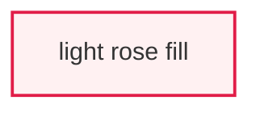

# Mermaid 11.16.1 dark theme with fill-only `classDef` styles produces unreadable light nodes

Status:
 resolved in this repository by commit `e917b3e10`.
This is a consumer styling error,
not a confirmed Mermaid defect.

## Symptom

A Mermaid flowchart rendered with `theme: 'dark'` can show nearly white text
inside nearly white boxes when a `classDef` sets a light `fill` but does not set
`color`.
In `doc/audit/oxlint-rule-architecture-review.html`,
the affected declarations had this shape before `e917b3e10`:



The report also supplied a global dark-theme text color at
`doc/audit/oxlint-rule-architecture-review.html:293-300`:

```javascript
const darkThemeVariables = {
  edgeLabelBackground: documentStyles.getPropertyValue('--color-dark-surface-2').trim(),
  textColor: documentStyles.getPropertyValue('--color-dark-text').trim(),
};
// ...
theme: preferredColorScheme.matches ? 'dark' : 'neutral',
themeVariables: preferredColorScheme.matches ? darkThemeVariables : {},
```

That combination produced these measured pairs:

- Light green nodes: foreground `rgb(248, 250, 252)`,
  background `rgb(236, 253, 245)`,
  contrast `1.01:1`.
- Light rose nodes: foreground `rgb(248, 250, 252)`,
  background `rgb(255, 241, 242)`,
  contrast `1.05:1`.
- Twenty-three of 58 rendered flowchart nodes were below `4.5:1`.

The page itself had no JavaScript error.
Axe reported the SVG `foreignObject` nodes as inconclusive rather than as
contrast violations,
so a zero-violation Axe result did not prove the diagrams were readable.

## Root cause

The failure comes from composing two independent style sources:
Mermaid chooses a theme-wide label color,
while `classDef` copies the author's fill directly.
Mermaid does not derive a new foreground color from an explicit class fill.

### Step 1: the dark theme supplies a light default label color

Mermaid maps the `dark` theme name to `theme-dark.js` in
`packages/mermaid/src/themes/index.js:17-19` at release commit
`7ecca0cd7f1658ef74f4e7e91f925724ef403bbf`:

```javascript
dark: {
  getThemeVariables: darkThemeVariables,
},
```

The theme sets its default text color to `#ccc` in
`packages/mermaid/src/themes/theme-dark.js:30`:

```javascript
this.textColor = '#ccc';
```

Flowchart CSS then uses `nodeTextColor` or falls back to `textColor` in
`packages/mermaid/src/diagrams/flowchart/styles.ts:36-52`:

```typescript
`.label {
  font-family: ${options.fontFamily};
  color: ${options.nodeTextColor || options.textColor};
}
// ...
.label text,span {
  fill: ${options.nodeTextColor || options.textColor};
  color: ${options.nodeTextColor || options.textColor};
}
```

The report's `themeVariables.textColor` changed that fallback from Mermaid's
`#ccc` to `#f8fafc`.
This made the symptom look white-on-white,
but it was only an amplifier:
the stock dark theme still measured `1.46:1` on the light rose fill and
`1.52:1` on the light green fill.

### Step 2: `classDef` records fill and text color as separate properties

The flowchart grammar forwards every `classDef` property to `addClass` in
`packages/mermaid/src/diagrams/flowchart/parser/flow.jison:533-535`:

```jison
classDefStatement:CLASSDEF SPACE idString SPACE stylesOpt
    {$$ = $CLASSDEF;yy.addClass($idString,$stylesOpt);}
```

`addClass` stores every property as a node style,
but only an explicit property containing `color` is also recorded as a text
style.
The deciding code is in
`packages/mermaid/src/diagrams/flowchart/flowDb.ts:406-427`:

```typescript
public addClass(ids: string, _style: string[]) {
  const style = _style
    .join()
    .replace(/\\,/g, '§§§')
    .replace(/,/g, ';')
    .replace(/§§§/g, ',')
    .split(';');
  ids.split(',').forEach((id) => {
    let classNode = this.classes.get(id);
    if (classNode === undefined) {
      classNode = { id, styles: [], textStyles: [] };
      this.classes.set(id, classNode);
    }

    style.forEach((s) => {
      if (/color/.exec(s)) {
        const newStyle = s.replace('fill', 'bgFill');
        classNode.textStyles.push(newStyle);
      }
      classNode.styles.push(s);
    });
  });
}
```

A fill-only class therefore has no label-specific override.
There is no call in this path that measures contrast or derives `color` from
`fill`.

### Step 3: the renderer intentionally applies shape and label styles separately

`styles2String` classifies `color` as a label property and all other node
properties as shape properties in
`packages/mermaid/src/rendering-util/rendering-elements/shapes/handDrawnShapeStyles.ts:61-85`:

```typescript
export const styles2String = (node: Node) => {
  const { stylesArray } = compileStyles(node);
  const labelStyles: string[] = [];
  const nodeStyles: string[] = [];

  stylesArray.forEach((style) => {
    const key = style[0];
    if (isLabelStyle(key)) {
      labelStyles.push(style.join(':') + ' !important');
    } else {
      nodeStyles.push(style.join(':') + ' !important');
    }
  });

  return {
    labelStyles: labelStyles.join(';'),
    nodeStyles: nodeStyles.join(';'),
    // ...
  };
};
```

For a rectangle,
`drawRect` assigns `labelStyles` to `node.labelStyle` and `nodeStyles` to the
shape at
`packages/mermaid/src/rendering-util/rendering-elements/shapes/drawRect.ts:14-17`
and `:51-55`:

```typescript
const { labelStyles, nodeStyles } = styles2String(node);
node.labelStyle = labelStyles;
// ...
rect
  .attr('class', 'basic label-container')
  .attr('style', nodeStyles)
```

`labelHelper` then places that separate label style on the label group at
`packages/mermaid/src/rendering-util/rendering-elements/shapes/util.ts:27-34`:

```typescript
const labelEl = shapeSvg
  .insert('g')
  .attr('class', 'label')
  .attr('style', handleUndefinedAttr(node.labelStyle));
```

With only `fill:#fff1f2`,
the rectangle gets a light inline fill and the label group gets no inline color.
The label therefore keeps the light dark-theme fallback.
With `color:#0f172a`,
the label receives `color:#0f172a !important` and becomes readable.

### Corrected hypotheses

The hypothesis that Mermaid ignored an explicitly supplied `color` was wrong.
The release harness measured `16.25:1` after adding `color:#0f172a`.
The historical issue [mermaid-js/mermaid#1955][issue-1955] concerned that older,
now-fixed inability to apply class text color;
PR [mermaid-js/mermaid#1956][pr-1956] added the supported path in 2021.

The report's global white text override was not the root cause.
Removing it changes the bad pair from roughly `1.05:1` to `1.46:1`,
which remains unreadable.
The missing foreground property in each light `classDef` was the deciding input.

## Verification

Verified on 2026-08-06 against Mermaid 11.16.1:

- npm integrity:
  `sha512-TQsq6u22fAn3rek5VOubrhKPo1g5hwC3FXUN9hiyupTckcYiGuuKGkNQrKYwGJkXUxZdojwRG46gsSCFZMDp4g==`.
- npm SHA-1:
  `57ae2342f6c45b967113b04c9258430bdd057ee8`.
- Release tag:
  `mermaid@11.16.1`.
- Release commit:
  `7ecca0cd7f1658ef74f4e7e91f925724ef403bbf`.
- Cloned origin:
  `https://github.com/mermaid-js/mermaid.git`.
- The floating jsDelivr URL used by the report returned
  `x-jsd-version: 11.16.1` during verification.

The relevant `flowDb.ts`,
`styles.ts`,
`theme-dark.js`,
and `handDrawnShapeStyles.ts` files are unchanged between Mermaid 11.16.0
and 11.16.1.
The source trace therefore matches the version currently resolved by the
report's `mermaid@11` CDN URL.

### Runnable harness

Save this source as `/tmp/mermaid-dark-classdef-contrast.html`:

```html
<!doctype html>
<html lang="en">
  <head>
    <meta charset="utf-8" />
    <title>Mermaid classDef contrast reproduction</title>
  </head>
  <body>
    <pre class="mermaid">
flowchart LR
  DEFAULT["default dark node"] --> DARK["dark fill only"]
  DARK --> ROSE["light rose fill only"]
  ROSE --> GREEN["light green fill only"]
  GREEN --> PAIRED["light fill and dark color"]
  classDef darkFill fill:#172033,stroke:#6366f1;
  classDef roseFill fill:#fff1f2,stroke:#e11d48;
  classDef greenFill fill:#ecfdf5,stroke:#059669;
  classDef paired fill:#fff1f2,color:#0f172a,stroke:#e11d48;
  class DARK darkFill;
  class ROSE roseFill;
  class GREEN greenFill;
  class PAIRED paired;
    </pre>
    <pre id="results"></pre>
    <script type="module">
      import mermaid from 'https://cdn.jsdelivr.net/npm/mermaid@11.16.1/dist/mermaid.esm.min.mjs';

      mermaid.initialize({
        startOnLoad: false,
        theme: 'dark',
        securityLevel: 'loose',
        flowchart: { htmlLabels: true },
      });
      await mermaid.run();

      const parseRgb = (value) => value
        .slice(value.indexOf('(') + 1, value.indexOf(')'))
        .split(',')
        .map(Number)
        .slice(0, 3);
      const luminance = (rgb) => rgb
        .map((channel) => channel / 255)
        .map((channel) => channel <= 0.03928
          ? channel / 12.92
          : ((channel + 0.055) / 1.055) ** 2.4)
        .reduce((sum, channel, index) => sum + channel * [0.2126, 0.7152, 0.0722][index], 0);
      const contrast = (foreground, background) => {
        const values = [luminance(parseRgb(foreground)), luminance(parseRgb(background))]
          .sort((left, right) => right - left);
        return Number(((values[0] + 0.05) / (values[1] + 0.05)).toFixed(2));
      };
      const measurements = Array.from(document.querySelectorAll('.node')).map((node) => {
        const label = node.querySelector('.nodeLabel');
        const shape = node.querySelector('rect');
        const foreground = getComputedStyle(label).color;
        const background = getComputedStyle(shape).fill;
        return {
          label: label.textContent,
          foreground,
          background,
          contrast: contrast(foreground, background),
        };
      });
      document.querySelector('#results').textContent = JSON.stringify(measurements, null, 2);
    </script>
  </body>
</html>
```

Run the browser harness:

```bash
agent-browser --session mermaid-classdef --allow-file-access \
  open file:///tmp/mermaid-dark-classdef-contrast.html
agent-browser --session mermaid-classdef --allow-file-access wait 3000
agent-browser --session mermaid-classdef --allow-file-access get text '#results'
agent-browser --session mermaid-classdef --allow-file-access close
```

Measured output:

```text
default dark node             #ccc on #1f2020   10.17:1
dark fill only                #ccc on #172033   10.13:1
light rose fill only          #ccc on #fff1f2    1.46:1
light green fill only         #ccc on #ecfdf5    1.52:1
light fill and dark color  #0f172a on #fff1f2   16.25:1
```

### Patterns that work cleanly

- Theme-owned dark node fill with theme-owned dark-theme text:
  `10.17:1`.
- Explicit dark fill with inherited dark-theme text:
  `10.13:1`.
- Explicit light fill paired with explicit dark `color`:
  `16.25:1`.
- The corrected report in dark mode:
  all 58 Mermaid nodes met `4.5:1`.

### Patterns that fail

- Light rose `fill:#fff1f2` without `color` under the stock dark theme:
  `1.46:1`.
- Light green `fill:#ecfdf5` without `color` under the stock dark theme:
  `1.52:1`.
- Either light fill with the report's former `textColor:#f8fafc` override:
  `1.01:1` to `1.05:1`.

## Verified workarounds

### Pair every explicit light fill with an explicit foreground

The repository fix adds `color:#0f172a` to every light `adapter` and `leak`
class at
`doc/audit/oxlint-rule-architecture-review.html:480`,
`:846`,
`:1026`,
`:1044`,
`:1199`,
and `:1364`:

```mermaid
classDef leak fill:#fff1f2,color:#0f172a,stroke:#e11d48,stroke-width:2px;
classDef adapter fill:#ecfdf5,color:#0f172a,stroke:#059669,stroke-width:2px;
```

Verification changed the failing-node count from 23 of 58 to zero of 58.
The same explicit pair remains readable under the report's neutral light theme.

Tradeoff:
foreground and fill now form one authored palette pair.
Changing either color requires rechecking contrast in every supported theme.
Mermaid will not recalculate the other half.

### Use theme-compatible dark fills in a dark-only diagram

The harness's `fill:#172033` node inherits `#ccc` and measures `10.13:1`.

Tradeoff:
this only works when the diagram is always dark.
If the same source switches to a light theme,
its inherited foreground can become dark and recreate the problem in reverse.
It is not suitable for this report's automatic light and dark modes.
