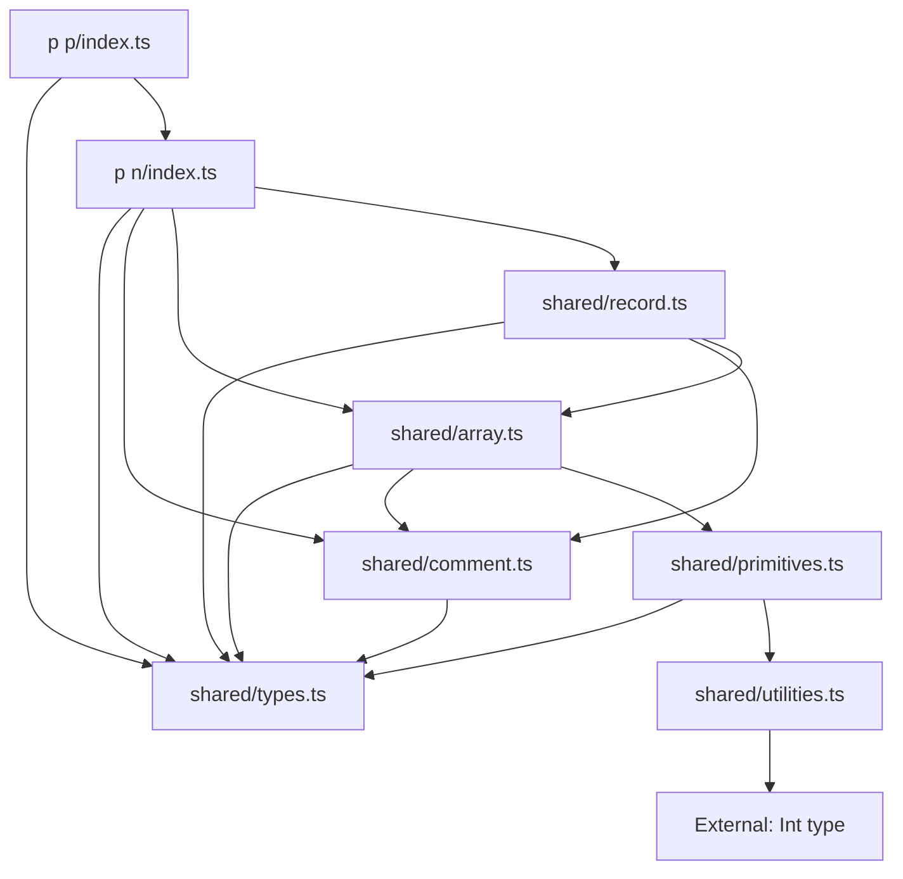

# JSONC Parser Refactoring Plan

## Overview

Split the monolithic JSONC parser in [`index.ts`](index.ts:1) into focused, reusable modules with clear separation of concerns.
This refactoring addresses incomplete implementations, missing return types, and code organization issues.

## Current Issues

- Incomplete implementations: [`customParserForArray()`](index.ts:290) and [`customParserForRecord()`](index.ts:470) lack return statements
- Undefined returns: Main [`$()`](index.ts:192) parser returns `undefined` at lines 223, 252
- Missing return types on several functions
- Uses banned `!` non-null assertion operator (lines 332, 336)
- Uses [`console.log()`](index.ts:212) instead of throwing errors with logged context
- Mixes concerns (types, parsing, utilities) in single file

## Proposed Structure

```txt
r s/
├── shared/
│   ├── types.ts           # Type definitions only
│   ├── comment.ts         # Comment extraction and merging
│   ├── primitives.ts      # Primitive value parsing
│   ├── utilities.ts       # Helper functions
│   ├── array.ts           # Array parsing logic
│   └── record.ts          # Record/object parsing logic
├── p n/
│   └── index.ts           # Named-parameter parser (current file)
└── p p/
    └── index.ts           # Positional-parameter parser
```

## Module Breakdown

### 1. shared/types.ts

**Purpose**: Central type definitions for JSONC parsing

**Exports** (lines 9-95):
- `FragmentStringJsonc` - Branded type for JSONC fragments
- `JsoncComment` - Comment metadata (type: inline/block/mixed, commentValue)
- `JsoncValueBase` - Base structure with optional comment
- `JsoncStringBase` - String value wrapper
- `JsoncNumberBase` - Number value wrapper
- `JsoncBooleanBase` - Boolean value wrapper
- `JsoncNullBase` - Null value wrapper
- `JsoncArrayBase` - Array value wrapper
- `JsoncRecordKey` - Record key type
- `JsoncRecordBase` - Record value wrapper
- `PlainJsonBase` - Fast-path optimization type
- `JsoncValue` - Union of all value types

**Dependencies**:
- `@_/types/t number/t finite/t int/t/index.ts` (Int type)
- `@_/types/t string/t hasQuotedSyntax/t doubleQuote/t jsonc/t/index.ts` (StringJsonc)
- `type-fest` (UnknownRecord)

### 2. shared/comment.ts

**Purpose**: Comment detection, extraction, and merging

**Exports** (lines 491-649):
- [`startsWithComment()`](index.ts:491) - Recursively extracts leading comments (inline and block)
- [`mergeComments()`](index.ts:618) - Combines multiple comments (with overloads)

**Key Logic**:
- Handles `//` inline comments (finds newline terminator)
- Handles `/*` block comments (multi-line detection with line comment interference check)
- Recursive comment chaining
- Comment type merging (inline + block = mixed)

**Dependencies**:
- `./types.ts` (JsoncComment, JsoncValueBase, StringJsonc, FragmentStringJsonc)

**Fixes Needed**:
- Replace template string error messages with `outdent` from `@cspotcode/outdent`
- Document why recursive parsing is used

### 3. shared/primitives.ts

**Purpose**: Parse primitive JSONC values (string, number, boolean, null)

**Exports** (extracted from lines 324-427):
- `parsePrimitive()` - Parses next primitive value from input
  - Handles quoted strings (regex: `/(?<!\\)(?:\\\\)*"/g`)
  - Handles `null`, `true`, `false` keywords
  - Handles numbers with intelligent boundary detection

**Key Logic** (from `getUntil` function):
- String parsing: Find unescaped quote
- Keyword parsing: Match exact keywords
- Number parsing: Binary search for valid JSON number length using [`numberLengthsToTestFirst`](index.ts:262)

**Returns**:
```ts
{
  consumed: string;           // What was parsed
  parsed: JsoncValue;         // Parsed value
  remaining: string;          // Unparsed content
}
```

**Dependencies**:
- `./types.ts` (JsoncValue, FragmentStringJsonc)
- `./utilities.ts` ([`getLengthsToTestFirst()`](index.ts:264), [`getArrayInts()`](index.ts:279), [`numberLengthsToTestFirst`](index.ts:262))

**Fixes Needed**:
- Add explicit return type to exported function
- Replace `!` operator with `notNullishOrThrow` (lines 332, 336)
- Replace [`console.error()`](index.ts:377) with error throwing
- Document number parsing algorithm

### 4. shared/utilities.ts

**Purpose**: General helper functions

**Exports** (lines 262-288):
- [`numberLengthsToTestFirst`](index.ts:262) - Array of lengths to test: `[1, 2, 4, 8, 16]`
- [`getLengthsToTestFirst()`](index.ts:264) - Filters lengths by upper bound
- [`getArrayInts()`](index.ts:279) - Generates integer range (exclusive bounds)

**Dependencies**:
- `@_/types/t number/t finite/t int/t/index.ts` (Int type)

**Fixes Needed**:
- Add TSDoc explaining binary search optimization strategy
- Consider moving [`getArrayInts()`](index.ts:279) to general utilities (TODO on line 278)
- Replace loop variable `length` with `testLength` for clarity

### 5. shared/array.ts

**Purpose**: Parse JSONC array structures

**Exports** (lines 290-452):
- [`customParserForArray()`](index.ts:290) - Incomplete array parser

**Current Implementation**:
- Strips opening `[`
- Extracts leading comments
- Handles empty arrays (`[]`)
- Starts nested array parsing (line 306)
- Starts nested record parsing (line 311)
- Parses first primitive item (line 324)
- Handles comma-separated items (line 430)

**Returns**: `JsoncValue & { remainingContent: FragmentStringJsonc; }`

**Dependencies**:
- `./types.ts` (JsoncValue, JsoncValueBase, FragmentStringJsonc, StringJsonc)
- `./comment.ts` ([`startsWithComment()`](index.ts:491))
- `./primitives.ts` (primitive parsing)

**Critical Fixes Needed**:
- **Complete implementation** - Currently stops at line 451 without return
- Add logic to collect all array items recursively
- Handle trailing commas in arrays
- Handle comments between items
- Add proper error handling for malformed arrays
- Add explicit return type

### 6. shared/record.ts

**Purpose**: Parse JSONC record/object structures

**Exports** (lines 470-489):
- [`customParserForRecord()`](index.ts:470) - Incomplete record parser

**Current Implementation**:
- Strips opening `{`
- Extracts leading comments
- Starts nested array parsing (line 480)
- Starts nested record parsing (line 485)

**Returns**: `JsoncValue`

**Dependencies**:
- `./types.ts` (JsoncValue, JsoncValueBase, FragmentStringJsonc, StringJsonc)
- `./comment.ts` ([`startsWithComment()`](index.ts:491))
- `./array.ts` ([`customParserForArray()`](index.ts:290))

**Critical Fixes Needed**:
- **Complete implementation** - Currently stops at line 489 without logic for:
  - Parsing record keys (must be quoted strings)
  - Parsing colon separator
  - Parsing record values
  - Handling comma-separated pairs
  - Handling trailing commas in objects
  - Handling comments between pairs
  - Handling empty objects (`{}`)
- Add proper error handling for malformed records
- Add explicit return type

### 7. p n/index.ts (Named Parameters)

**Purpose**: Main JSONC parser with named-parameter interface

**Current Exports** (lines 192-260):
- [`$()`](index.ts:192) - Main parser function with signature: `({ value }: { value: StringJsonc }): JsoncValue`

**Implementation Strategy**:
- Extract leading comments via [`startsWithComment()`](index.ts:491)
- Check if starts with `[` or `{`
- Attempt fast-path with `JSON.parse` after trailing comma removal
- Fall back to custom parser if fast-path fails
- Delegate to [`customParserForArray()`](index.ts:290) or [`customParserForRecord()`](index.ts:470)

**Imports After Refactor**:
```ts
import type { $ as Int } from '@_/types/t number/t finite/t int/t/index.ts';
import type { $ as StringJsonc } from '@_/types/t string/t hasQuotedSyntax/t doubleQuote/t jsonc/t/index.ts';
import type { UnknownRecord } from 'type-fest';
import type { FragmentStringJsonc, JsoncValue } from '../shared/types.ts';
import { startsWithComment } from '../shared/comment.ts';
import { customParserForArray } from '../shared/array.ts';
import { customParserForRecord } from '../shared/record.ts';
```

**Fixes Needed**:
- Replace `undefined` returns with proper `JsoncValue` (lines 223, 252)
- Replace [`console.log()`](index.ts:212) with [`console.error()`](index.ts:212) and proper error throwing
- Add explicit `: JsoncValue` return type
- Fix typo on line 235: `}]` should be `}}`

### 8. p p/index.ts (Positional Parameters)

**Purpose**: Main JSONC parser with positional-parameter interface

**New Implementation**:
```ts
import type { $ as StringJsonc } from '@_/types/t string/t hasQuotedSyntax/t doubleQuote/t jsonc/t/index.ts';
import type { JsoncValue } from '../shared/types.ts';
import { $ as parseNamed } from '../p n/index.ts';

/**
 * {@inheritDoc parseNamed}
 */
export function $(value: StringJsonc): JsoncValue {
  return parseNamed({ value });
}
```

Thin wrapper that calls named-parameter version.

## Implementation Order

**Phase 1: Foundation**
1. Create [`shared/types.ts`](shared/types.ts) - No dependencies on other shared modules
2. Create [`shared/utilities.ts`](shared/utilities.ts) - Only depends on external types
3. Create [`shared/comment.ts`](shared/comment.ts) - Depends on [`types.ts`](shared/types.ts)
4. Create [`shared/primitives.ts`](shared/primitives.ts) - Depends on [`types.ts`](shared/types.ts), [`utilities.ts`](shared/utilities.ts)

**Phase 2: Complex Parsers**
5. Create [`shared/array.ts`](shared/array.ts) - Depends on [`types.ts`](shared/types.ts), [`comment.ts`](shared/comment.ts), [`primitives.ts`](shared/primitives.ts)
6. Create [`shared/record.ts`](shared/record.ts) - Depends on [`types.ts`](shared/types.ts), [`comment.ts`](shared/comment.ts), [`array.ts`](shared/array.ts)

**Phase 3: Main Parsers**
7. Update [`p n/index.ts`](index.ts) - Imports all shared modules
8. Create [`p p/index.ts`](../p%20p/index.ts) - Wraps named-parameter version

**Phase 4: Quality**
9. Add comprehensive TSDoc to all modules
10. Create unit tests for each module
11. Fix all incomplete implementations
12. Verify end-to-end parsing works

## Testing Strategy

**Unit Tests Per Module**:
- [`shared/types.ts`](shared/types.ts) - Type-level tests with `expectTypeOf`
- [`shared/utilities.ts`](shared/utilities.ts) - Test length generation and integer ranges
- [`shared/comment.ts`](shared/comment.ts) - Test inline/block/mixed comment extraction
- [`shared/primitives.ts`](shared/primitives.ts) - Test all primitive types and edge cases
- [`shared/array.ts`](shared/array.ts) - Test empty arrays, nested arrays, comments, trailing commas
- [`shared/record.ts`](shared/record.ts) - Test empty objects, nested objects, comments, trailing commas
- [`p n/index.ts`](index.ts) - Integration tests with complex JSONC
- [`p p/index.ts`](../p%20p/index.ts) - Verify wrapper works identically

**Test File Naming**:
- `shared/types.type.test.ts`
- `shared/utilities.unit.test.ts`
- `shared/comment.unit.test.ts`
- `shared/primitives.unit.test.ts`
- `shared/array.unit.test.ts`
- `shared/record.unit.test.ts`
- `p n/index.unit.test.ts`
- `p p/index.unit.test.ts`

## Code Quality Improvements

**Error Handling**:
- Replace [`console.log(error)`](index.ts:212) with `console.error('Failed to parse with fast-path:', error)` before deferring
- Replace non-null assertions `!` (lines 332, 336) with `notNullishOrThrow(match.index)`
- Use `outdent` for multi-line error messages (lines 512-517, 587-592)
- Log ALL errors in catch blocks, even expected ones

**Type Safety**:
- Add explicit return types: `JsoncValue`, `JsoncComment | undefined`, etc.
- Use `const` for [`numberLengthsToTestFirst`](index.ts:262) array (already done)
- Replace magic string literals with named constants where appropriate

**Code Style**:
- Remove unused `_num*` constants (lines 455-465) or document why they exist
- Replace loop variable names: `length` → `testLength`, `lengthToTest` → `candidateLength`
- Add region markers to delineate logical sections
- Extract complex conditions into named functions

**Documentation**:
- Add TSDoc to all exported functions
- Explain WHY hierarchical optimization is used (native JSON.parse for clean sections)
- Document the binary search algorithm for number length detection
- Add examples for each function
- Document edge cases and error conditions

## Dependencies Between Modules



## Implementation Checklist

**Shared Modules**:
- [ ] Create `shared/types.ts` with all type definitions
- [ ] Create `shared/utilities.ts` with helper functions
- [ ] Create `shared/comment.ts` with comment parsing
- [ ] Create `shared/primitives.ts` with primitive parsing
- [ ] Create `shared/array.ts` with array parsing
- [ ] Create `shared/record.ts` with record parsing

**Main Parsers**:
- [ ] Update `p n/index.ts` to import shared modules
- [ ] Create `p p/index.ts` as thin wrapper
- [ ] Remove duplicated code from `p n/index.ts`

**Quality**:
- [ ] Add explicit TypeScript return types to all functions
- [ ] Add comprehensive TSDoc comments
- [ ] Replace banned `!` operator with `notNullishOrThrow`
- [ ] Replace [`console.log`](index.ts:212) with proper error logging
- [ ] Use `outdent` for multi-line error messages
- [ ] Complete [`customParserForArray()`](index.ts:290) implementation
- [ ] Complete [`customParserForRecord()`](index.ts:470) implementation
- [ ] Fix undefined returns in main parser

**Testing**:
- [ ] Create unit tests for each shared module
- [ ] Create integration tests for main parsers
- [ ] Achieve 100% code coverage
- [ ] Test all error paths
- [ ] Test edge cases (empty arrays/objects, nested structures, mixed comments)

## Migration Impact

**Breaking Changes**: None (API remains identical)

**Internal Changes**:
- Code organization improved
- Testability enhanced
- Reusability increased for parser components

**Verification Steps**:
1. Run `moon run build` to ensure no TypeScript errors
2. Run `moon run testUnit` to verify all tests pass
3. Check imports resolve correctly between modules
4. Verify no circular dependencies

## Benefits

**Maintainability**:
- Single responsibility per module
- Clear dependency graph
- Easier to test in isolation
- Simpler to understand and modify

**Code Quality**:
- Explicit return types prevent undefined leaks
- Proper error handling with context
- Adherence to TypeScript standards
- Complete implementations

**Reusability**:
- Comment parsing can be used independently
- Primitive parsing can be used for other formats
- Utility functions available for similar parsers
