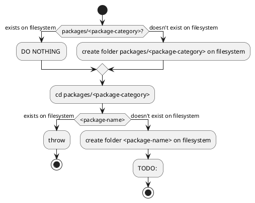

# Roadmap

I planned to get the project in a reasonable state at the end of March.
However, that deadline won't be met.

## DONE: Replaced! Potentially replace Bun with pnpm

Bun is written in Zig and pnpm is written in TypeScript.
Using Bun to execute TypeScript directly is nice, but unnecessary.
However, as of 2024MAR29, Bun is still incompatible with Astro, which results in having to install Node as well,
which invalidates the point of using an all-in-one package manager and runtime.

Also, see `## Bun` section in `readme.md` (will be migrated to another file).

## DONE: Replace [Effect](https://effect.website) with rambdax

Effect is just too large, also,
I still don't understand why I'd use its way to write code even after reading all its docs.

## DONE: Remove obsolete `vite-plugins`

I wrote the Vite plugin that allows vite to import TOML files,
but then I thought maybe just using the TOML library itself
and read the file at runtime makes the code less likely to break should I have to migrate it to use a different bundler.

## DONE: Put `consts.js` in a better place and give it types.

It's no good to put files that are not relevant to the user (in this case, the eventual author of the contents of the blog) in front of the user's face.

## Write `cpfd`

Copy Files From Dependencies

## Write `increase-version`

So every time I publish new changes it's guranteed to have a new version.

## Write `add-scripts`

Add new npm scripts to the target package every time a new package is created.

## Dim side"bar" (.Aside) when hovering over main

## DONE: Astro/CSS formatter

[dprint markup_fmt (Astro)](https://github.com/g-plane/markup_fmt)

[dprint malva (CSS)](https://github.com/g-plane/malva)

## Rewrite Astro RSS endpoint

## feat(docs): Write why we're not including any style or script tags in .astro files

## Write `monochromatic` cli

### `monochromatic new <monorepo-name>`


### `monochromatic new <package-category>/<package-name>`



## PlantUML integration

### DONE: Dev Containers

## Optimize SVG

Just look at this snippet of an svg generated by PlantUML:

```svg
<svg xmlns="http://www.w3.org/2000/svg" xmlns:xlink="http://www.w3.org/1999/xlink" contentStyleType="text/css" height="697px" preserveAspectRatio="none" style="width:5883px;height:697px;background:#FFFFFF;" version="1.1" viewBox="0 0 5883 697" width="5883px" zoomAndPan="magnify"><defs/><g><ellipse cx="2598.875" cy="20" fill="#222222" rx="10" ry="10" style="stroke:#222222;stroke-width:1.0;"/><rect fill="#F1F1F1" height="33.9688" rx="12.5" ry="12.5" style="stroke:#181818;stroke-width:0.5;" width="191" x="2503.375" y="98.4023"/><text fill="#000000" font-family="sans-serif" font-size="12" lengthAdjust="spacing" textLength="171" x="2513.375" y="119.541">redirect to duckduckgo.com</text><ellipse cx="2598.875" cy="171.8867" fill="none" rx="11" ry="11" style="stroke:#222222;stroke-width:1.0;"/><ellipse cx="2598.875" cy="171.8867" fill="#222222" rx="6" ry="6" style="stroke:#222222;stroke-width:1.0;"/><polygon fill="#F1F1F1" points="2586.875,50,2610.875,50,2622.875,62,2610.875,74,2586.875,74,2574.875,62,2586.875,50" style="stroke:#181818;stroke-width:0.5;"/><text fill="#000000" font-family="sans-serif" font-size="11" lengthAdjust="spacing" textLength="21" x="2602.875" y="84.2104">yes</text><text fill="#000000" font-family="sans-serif" font-size="11" lengthAdjust="spacing" textLength="13" x="2592.375" y="65.8081">q?</text><text fill="#000000" font-family="sans-serif" font-size="11" lengthAdjust="spacing" textLength="14" x="2622.875" y="59.4058">no</text><polygon fill="#F1F1F1"
```

Notice the redundant height/width attribute on root and all the fill attributes on sub elements.
The explicit specification of font-size and so is also bad for accessibility.

### Write custom Astro Image Local Service

## DOING: Switch to Astro Content Collections

Here are some of the reasons.
I forgot the others.

### Take advantage of Astro incremental build

## Add a way for authors to specify license.

## MAYBE: Find a way to format mdx priority:low

## MAYBE: Use pagefind or other tools to pre-generate search results pages.

## TODO: Comment system

### TODO: webmention

### TODO: gisgus

### MAYBE: allow defining 3rd party comment system

## TODO: Migrate from execa to native node child_process exec

## MAYBE: Support lang subtypes.

Currently, the .-MatchLang Astro component doesn't support lang subtypes, which makes it impossible to make a site available in both zh-CN and zh-SC variants.

## TODO: Use multiple, localized 404 pages. #priority:normal

## MAYBE: Migrate to named function expressions

for easier debugging.

## MAYBE: Write a polyfill for [text fragments](https://developer.mozilla.org/en-US/docs/Web/Text_fragments)

Or maybe not.

Firefox Nightly 126.0a1 now has the `about:config` option `dom.text_fragments.enabled`,
which [implements first version of text fragments](https://bugzilla.mozilla.org/show_bug.cgi?id=1867939).

If we target Firefox ESR 128, which is to be released on July 9th, we can skip this.

## MAYBE: Integrate automatic translation #priority:low

[deepl-node](https://github.com/DeepLcom/deepl-node)

## TODO: Set default modified date by `git log`

## TODO: Write custom lightningCSS resolver to correctly resolve node_modules

## TODO: Submit `packageExtensions` to `pnpm`

```json
  "pnpm": {
    "packageExtensions": {
      "fs-extra": {
        "dependencies": {
          "universalify": "*"
        }
      }
    }
  }
```

Otherwise, when using `api-extractor`:

```text
[1] > api-extractor run --local --verbose
[1]
[1] /workspaces/monochromatic2024MAR06/.pnp.cjs:9732
[1]     throw firstError;
[1]     ^
[1]
[1] Error: fs-extra tried to access universalify, but it isn't declared in its dependencies; this makes the require call ambiguous and unsound.
[1]
[1] Required package: universalify (via "universalify")
[1] Required by: fs-extra@7.0.1 (via /workspaces/monochromatic2024MAR06/node_modules/.pnpm/fs-extra@7.0.1/node_modules/fs-extra/lib/fs/)
[1]
[1] Require stack:
[1] - /workspaces/monochromatic2024MAR06/node_modules/.pnpm/fs-extra@7.0.1/node_modules/fs-extra/lib/fs/index.js
[1] - /workspaces/monochromatic2024MAR06/node_modules/.pnpm/fs-extra@7.0.1/node_modules/fs-extra/lib/index.js
[1] - /workspaces/monochromatic2024MAR06/node_modules/.pnpm/@rushstack+node-core-library@4.0.2_@types+node@20.12.7/node_modules/@rushstack/node-core-library/lib/FileSystem.js
[1] - /workspaces/monochromatic2024MAR06/node_modules/.pnpm/@rushstack+node-core-library@4.0.2_@types+node@20.12.7/node_modules/@rushstack/node-core-library/lib/Executable.js
[1] - /workspaces/monochromatic2024MAR06/node_modules/.pnpm/@rushstack+node-core-library@4.0.2_@types+node@20.12.7/node_modules/@rushstack/node-core-library/lib/index.js
[1] - /workspaces/monochromatic2024MAR06/node_modules/.pnpm/@rushstack+terminal@0.10.0_@types+node@20.12.7/node_modules/@rushstack/terminal/lib/NormalizeNewlinesTextRewriter.js
[1] - /workspaces/monochromatic2024MAR06/node_modules/.pnpm/@rushstack+terminal@0.10.0_@types+node@20.12.7/node_modules/@rushstack/terminal/lib/index.js
[1] - /workspaces/monochromatic2024MAR06/node_modules/.pnpm/@microsoft+api-extractor@7.43.0_@types+node@20.12.7/node_modules/@microsoft/api-extractor/lib/start.js
[1] - /workspaces/monochromatic2024MAR06/node_modules/.pnpm/@microsoft+api-extractor@7.43.0_@types+node@20.12.7/node_modules/@microsoft/api-extractor/bin/api-extractor
[1]     at internalTools_makeError (/workspaces/monochromatic2024MAR06/.pnp.cjs:9476:34)
[1]     at resolveToUnqualified (/workspaces/monochromatic2024MAR06/.pnp.cjs:10441:23)
[1]     at resolveRequest (/workspaces/monochromatic2024MAR06/.pnp.cjs:10533:29)
[1]     at Object.resolveRequest (/workspaces/monochromatic2024MAR06/.pnp.cjs:10611:26)
[1]     at external_module_.Module._resolveFilename (/workspaces/monochromatic2024MAR06/.pnp.cjs:9709:34)
[1]     at external_module_.Module._load (/workspaces/monochromatic2024MAR06/.pnp.cjs:9574:48)
[1]     at Module.require (node:internal/modules/cjs/loader:1231:19)
[1]     at require (node:internal/modules/helpers:179:18)
[1]     at Object.<anonymous> (/workspaces/monochromatic2024MAR06/node_modules/.pnpm/fs-extra@7.0.1/node_modules/fs-extra/lib/fs/index.js:4:11)
[1]     at Module._compile (node:internal/modules/cjs/loader:1369:14)
[1]
[1] Node.js v20.12.0
[1]  ELIFECYCLE  Command failed with exit code 1.
[1]  ELIFECYCLE  Command failed with exit code 1.
```
