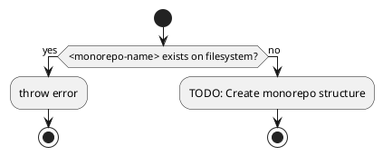
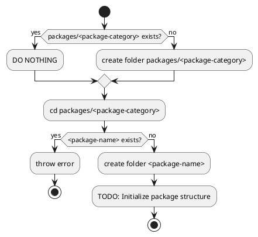

# Todo

## WSL Migration - Post-Migration Tasks

### Immediate Tasks (June 19, 2025)
1. **Install dependencies in WSL location**
   ```bash
   cd ~/projects/monochromatic
   pnpm install
   ```

2. **Run initial setup**
   ```bash
   moon run prepare
   ```

3. **Verify build system**
   ```bash
   moon run build
   moon run test
   ```

4. **Set up VSCode for WSL**
   - Open VSCode: `code .` from WSL terminal
   - VSCode will auto-install WSL extension
   - Ensure all extensions work in WSL environment

5. **Performance verification**
   - Compare build times between Windows mount and WSL filesystem
   - Test file watching performance with `moon run buildWatch`

6. **Clean up Windows copy**
   - After confirming everything works perfectly
   - `rm -rf /mnt/c/Users/user/Text/Projects/Aquaticat/monochromatic2025MAY24-pnpmTest`

### Migration Benefits Achieved
- Native Linux moon binary (no path translation issues)
- 10-50x faster file operations
- Better integration with Linux tooling
- Cleaner development environment

## CLI Tools and Scripts

### Write `cpfd` - Copy Files From Dependencies
Create a tool to copy files from dependencies into the project.

### Write `increase-version` 
Automate version bumping to ensure every publish has a new version.

### Write `add-scripts`
Add new NPM scripts to the target package every time a new package is created.

### Monochromatic CLI Development
Currently settling on writing a few moon plugins instead of a full CLI.

#### `monochromatic new <monorepo-name>`


#### `monochromatic new <package-category>/<package-name>`


## Build System and Package Management

### Generate entire `package.json` automatically from `package.jsonc`
Make it bidirectional update to keep both files in sync.

### Write `package.jsonc` support
Add JSON with Comments support for package configuration.

### Migrate from execa to native node child_process exec
Remove external dependency and use Node.js built-in functionality.

### Submit `packageExtensions` to `pnpm`
Previously needed for fs-extra/universalify dependency issue (no longer using fs-extra, but keeping for reference).

## Documentation and Content

### PlantUML integration
Add support for PlantUML diagrams in documentation.

### Optimize SVG
Reduce redundant attributes in PlantUML-generated SVGs:
- Remove redundant height/width attributes
- Optimize fill attributes on subelements
- Make font-size and similar properties more accessible

### Use pagefind or other tools to pre-generate search results pages
Improve search functionality with pre-generated results.

### Set default modified date by `git log`
Automatically set document modification dates from git history.

### Localization and Internationalization

#### Use multiple, localized 404 pages
Priority: normal

#### Integrate automatic translation
Priority: low
Consider using [deepl-node](https://github.com/DeepLcom/deepl-node)

## UI/UX Improvements

### Dim sidebar (.Aside) when hovering over main
Currently on hold - could be annoying for users.

### Comment System Implementation

#### Webmention support
Implement decentralized web mention protocol.

#### Giscus integration
Add GitHub Discussions-based commenting.

#### Allow defining 3rd party comment system
Make comment system pluggable for flexibility.

## Framework Updates

### Rewrite Astro RSS endpoint
Note: Seems like they've fixed it, so no work needed.

### Find a way to format mdx
Priority: low

### Write custom lightningCSS resolver
Note: Switched back to postcss. Holding onto this idea in case future lightningcss updates make it better than postcss.

## Development Environment

### WSL Debian Distro - Selective Windows Directory Mounting

#### Overview
Configure Debian WSL distro to mount only specific Windows directories instead of auto-mounting all drives, improving security while maintaining access to development files.

#### Required Mount Points
- `/mnt/c/Users/user/Text/Projects` - Development projects
- `/mnt/c/Users/user/.pnpm-store` - pnpm global package store

#### Configuration Steps

1. **Edit WSL Configuration**
   ```bash
   sudo nano /etc/wsl.conf
   ```
   Add:
   ```ini
   [automount]
   enabled = false
   mountFsTab = true
   ```

2. **Create Mount Points**
   ```bash
   sudo mkdir -p /mnt/c/Users/user/Text/Projects
   sudo mkdir -p /mnt/c/Users/user/.pnpm-store
   ```

3. **Configure fstab**
   ```bash
   sudo nano /etc/fstab
   ```
   Add:
   ```
   C:/Users/user/Text/Projects /mnt/c/Users/user/Text/Projects drvfs defaults,uid=1000,gid=1000 0 0
   C:/Users/user/.pnpm-store /mnt/c/Users/user/.pnpm-store drvfs defaults,uid=1000,gid=1000 0 0
   ```

4. **Apply Changes Without Full WSL Restart**
   
   Option A - Restart only Debian distro:
   ```powershell
   # From Windows PowerShell
   wsl -t Debian
   ```
   
   Option B - Apply in current session (temporary):
   ```bash
   # Unmount existing
   sudo umount /mnt/c 2>/dev/null
   
   # Mount manually
   sudo mount -t drvfs 'C:/Users/user/Text/Projects' /mnt/c/Users/user/Text/Projects -o uid=1000,gid=1000
   sudo mount -t drvfs 'C:/Users/user/.pnpm-store' /mnt/c/Users/user/.pnpm-store -o uid=1000,gid=1000
   ```
   
   Option C - With systemd:
   ```bash
   sudo systemctl daemon-reload
   sudo mount -a
   ```

#### Verification
```bash
# Check mounted directories
mount | grep drvfs

# Test access
ls /mnt/c/Users/user/Text/Projects
```

#### Notes
- This configuration is specific to the Debian WSL distro only
- Other WSL distros (including those running Docker/Podman) are unaffected
- To add more directories later, update `/etc/fstab` and remount

## Code Quality and Patterns

### Meilisearch Task Polling Implementation Evolution

The user repeatedly asked "Do you really need..." to guide me through progressively simpler implementations:

1. Started with mutable `let taskStatus` and `while` loop with inline constants
2. "Do you really need a mutable variable?" → Moved to immutable `const` inside loop, hoisted constants
3. "Do you really need a while(true) break pattern?" → Changed to `while` with proper condition
4. "Do you really need a while loop at all?" → Changed to `for` loop with calculated iterations
5. "Do you really need a for loop?" → Changed to recursive helper function

Next conversation hint: async iterator helper `takeUntil` - likely a functional approach that avoids explicit loops entirely.

#### Final Implementation Plan: Simple Array with `findAsync`

The simplest approach uses a dummy array with `findAsync`:

```typescript
// Create array of 100 nulls as a counter
const polls = new Array(100).fill(null);

// Use findAsync where the predicate does all the work
try {
  const completedStatus = await findAsync(
    polls,
    async () => {
      const status = await client.tasks.getTask(task.taskUid);
      if (!isTaskPending(status.status)) {
        return status;
      }
      await wait(TASK_POLL_INTERVAL_MS);
      return false;
    }
  );
  
  if (completedStatus) {
    if (completedStatus.status !== 'succeeded') {
      console.error(`Task ${task.taskUid} failed:`, completedStatus.error);
      allTasksSuccessful = false;
    }
  } else {
    console.error(`Task ${task.taskUid} timed out after ${TASK_TIMEOUT_MS}ms`);
    allTasksSuccessful = false;
  }
} catch (error) {
  console.error(error);
  allTasksSuccessful = false;
}
```

#### Late Night Ideas (1am ramblings) and Potential Improvements

User's thoughts at 1am:
- The array might be unnecessary with a different utility function (maybe something like `repeatUntil` or `retryAsync`?)
- The array could be filled with all the taskUids so every task is validated at the same time (parallel polling instead of sequential)

My guesses on these ideas:
1. **Different utility function**: Perhaps a `times` or `repeat` async function that runs a predicate N times until it returns truthy
   - `const status = await repeatAsync(100, async () => { /* poll logic */ })`
   - This would eliminate the dummy array entirely

2. **Parallel task validation**: Instead of polling tasks one by one in the batch loop:
   - Create an array of all taskUids from the batch
   - Use `Promise.all` with `findAsync` for each task
   - Or better: a single `findAsync` that polls ALL tasks in each iteration
   - This could dramatically reduce total wait time when indexing multiple batches

```typescript
// Hypothetical parallel approach
const allTaskUids = batches.map(batch => batch.taskUid);
const completed = await findAsync(
  new Array(100).fill(null),
  async () => {
    const statuses = await Promise.all(
      allTaskUids.map(uid => client.tasks.getTask(uid))
    );
    const allCompleted = statuses.every(s => !isTaskPending(s.status));
    if (!allCompleted) {
      await wait(TASK_POLL_INTERVAL_MS);
    }
    return allCompleted ? statuses : false;
  }
);
```

Good night!

#### Lessons from "Do you really need..."

This questioning pattern taught me to:
1. **Question every construct** - Each programming construct adds complexity
2. **Prefer immutability** - Mutable variables should be eliminated when possible
3. **Prefer declarative over imperative** - Loops can often be replaced with higher-order functions
4. **Extract and name concepts** - Helper functions like `isTaskPending` improve readability
5. **Think functionally first** - There's often a functional solution that's cleaner
6. **Simplify progressively** - Don't stop at the first working solution

The progression from imperative loops to recursive functions to (eventually) async iterators shows how the same problem can be solved with decreasing complexity and increasing elegance.

## Priority Levels

### High Priority
- CLI tools development (cpfd, increase-version, add-scripts)
- Package.jsonc support and bidirectional sync

### Normal Priority
- Multiple localized 404 pages
- PlantUML integration
- SVG optimization

### Low Priority
- MDX formatting
- Automatic translation integration
- Dim sidebar on hover (on hold)

### Completed/No Action Needed
- Astro RSS endpoint (fixed upstream)
- lightningCSS resolver (switched to postcss)
- fs-extra packageExtensions (no longer using fs-extra)

## Husky to Moon Migration (June 2025)

### Completed
- [x] Research Moon's VCS hooks capabilities and configuration
- [x] Back up all package.json files with scripts to `bak/20250619_233329/`
- [x] Remove scripts from all package.json files
- [x] Setup Moon MCP server in ~/.claude.json for better task discovery

### To Do
- [ ] Create migration plan from Husky to Moon hooks
- [ ] Get second opinion from Zen on the migration plan
- [ ] Remove Husky configuration and dependencies
- [ ] Implement Moon VCS hooks configuration
- [ ] Test the new pre-commit hooks

### Notes
- Moon supports VCS hooks via `vcs.hooks` in `.moon/workspace.yml`
- `syncHooks: true` is already configured in the workspace
- Need to determine which tasks to run in pre-commit hooks
- Husky is still in dependencies and needs to be removed
- The old Husky pre-commit hook had: `yarn run -T -B monochromatic precommit` (commented out)